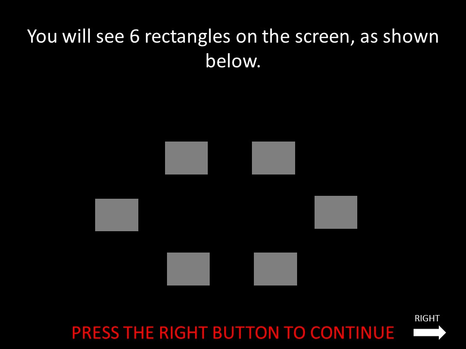

# README for the Sequential Planning Task



# **SUMMARY**

Subjects are presented with 6 boxes on screen, where they must traverse around the boxes in order to get the most points.
Each transions from 1 box to the other is fixed with the same value.

## Training 1


### PR1
 1) A free training phase lets the participant explore the maze. It's 
   duration can be specified by params.file .

### PR2
 2) A goal training phase presents the participant with many tasks to be
   solved (You start at X, your goal is Y, you have Z moves). A task is
   repeated until solved successfully.
   Includes 3 differenet sections. They must have an error that is less than g.maxError in order to proceed.

   **Administrators can skip over each test by pressing the 's' key**

   The number of attemps will be saved to the params file. under 'goal_training_depth[1-3]_tries'

   - Depth 1: Where participants are tested on path of 1 length
   - Depth 2: Where participants are tested on path of 2 length
   - Depth 3: Where participants are tested on path of 4 length

## Training 2

### PR3 
 1) A free training phase lets the participant explore the maze and the
   rewards attached to each transition/move. The duration can be specified 
   by params.freeTrainingDuration2.

### PR4
 2) A path test phase where participants are tested on the transition values.
   Through multiple choice

   **Administrators can skip over the test by pressing the 's' key**
   The number of attemps will be saved to the params file. under 'path_test_tries'

### PR5
 3) A task training phase explains and introduces how the real task will
   work. The participant has to do a few trials without time constraints,
   followed by a few trials with the (usually 9 seconds) time constraint.

  
## Main Scan Session 

### PR6
10 trials of the main session.

### R1
144 Trials of the main session.

# OUTCOMES
There are 5 differente types of outcomes.

1) Optimal no large loss correct    (ONLL Correct)
   Optimal sequence chosen where this does not include a large loss

2) Optimal large loss correct       (OLL Correct)
   Optimal sequence chosen where this includeds a large loss

3) Aversive Planning(AP)
   The best sequence that avoids large losses chosen when the optimal sequence includes as least one large loss

4) Optimal no large loss error (ONLL error)
   Suboptimal sequence chose for this trial type

5) Optimal large loss error (OLL error)
   All suboptimal, sequence chosen for this trial type, not including aversive pruning


# **TRIAL STRUCTURE**
```
[         instructions         ] ->
^                              ^
INSTRUCT_ONSET                 TASK_ONSET


|<---------------------------------15-17s seconds total duration---------------------------------------------------------------->|
[  show states  ] -> [     response      ] -> [       animation        ]  -> [    feedback    ] -> [      fixation  shown        ]
+---------------+    +-------------------+    +------------------------+     +----------------+    +-----------------------------+
|   9s duration |    |  2.5s duartion    |    |2.25s - 3.75s duration  |     |   1s duration  |    |   ~ variable duration       |
+---------------+    +-------------------+    +------------------------+     +----------------+    +-----------------------------+
|   planning    |    |  to enter moves   |    |  to show anim          |     | to show points |    | variable about duratio from | 
|               |    |                   |    |                        |     |                |    |TRIAL_ONSET to FIXATION_ONSET|
^                    ^                        ^                              ^                     ^
TRIAL_ONSET          RESPONSE_ONSET           ANIMATION_ONSET                FEEDBACK_ONSET        FIXATION_ONSET
PLANNING_ONSET       RESPONSE                                                OUTCOME

```

# **INPUT DETAILS**

```
EACH LINE CODES: one trial
COLUMN 1: Trial Type (depth)
COLUMN 2: Initial State
COLUMN 3: Goal State (used for practice runs) 
COLUMN 4: Duration 
COLUMN 5: 
COLUMN 6: Correct Category

TRIAL ORDER IS: fixed
```

# **OUTPUT DETAILS**

```
INSTRUCT_ONSET (1)
response_time: not used
response: not used
result: not used

TASK_ONSET (2)
response_time: time between INSTRUCT_ONSET and TASK_ONSET
response: not used
result: not used

TRIAL_ONSET (3)
response_time: not used
response: not used
result: not 
trial_type: depth 

PLANNING_ONSET (4)
response_time: not used
response: not used
result: initial_state
trial_type: depth 

RESPONSE_ONSET (5)
response_time: time since PLANNING_ONSET
response: not used
result: not used
trial_type: depth 

ANIMATION_ONSET (6)
response_time: not used
response: not used
result: not used

FIXATION_ONSET (7)
response_time: not used
response: not used
result: duration

RESPONSE (8)
response_time: time since PLANNING_ONSET
response: button pressed. 1 for right, -1 for left
result: points
trial_type: {initial state}_{depth_value}_{index key number. i.e the 3rd key pressed, indext starts at 0}

FEEDBACK (9)
response_time: not used
response: not used
result: points

OUTCOME (10)
response_time: not used
response: not used
result: 1 of the 5 outcomes. (ONLL_correct, OLL_correct, AP, ONLL_error, OLL_error). see OUTCOME for explanation.

BREATHING_LOAD (11)
response_time: not used
response: not used
result: breathing load response

EXTENDING_TIME (11)
response_time: duration from TRIAL_ONSET to END of ANIMATION
response: not used
result: amount of seconds added to trial

```